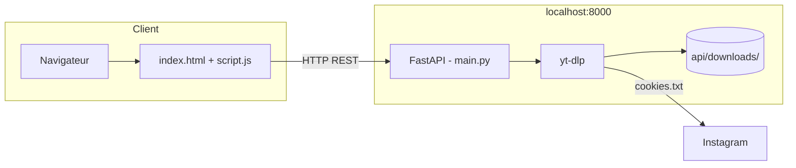

# Instagram Downloader

Application web pour télécharger des médias Instagram (posts, reels, stories, IGTV) via une interface simple et une API FastAPI.

---

## Sommaire

1. [Fonctionnalités](#fonctionnalités)
2. [Architecture](#architecture)
3. [Structure du projet](#structure-du-projet)
4. [Prérequis](#prérequis)
5. [Installation](#installation)
6. [Démarrage rapide](#démarrage-rapide)
7. [Utilisation](#utilisation)
8. [API REST](#api-rest)
9. [Cookies Instagram](#cookies-instagram)
10. [Dépannage](#dépannage)

---

## Fonctionnalités

- **Aperçu** : titre, auteur, miniature avant téléchargement
- **Formats** : MP4 (vidéo), JPG (image), MP3 (audio)
- **Qualités** : haute, moyenne, basse, ou extraction audio seule
- **Contrôles** : pause, reprise, annulation en cours de téléchargement
- **Barre de progression** en temps réel
- **Documentation API** interactive (Swagger) sur `/docs`

---

## Architecture



Le serveur FastAPI sert **à la fois** l’interface web et l’API sur le port **8000**.

---

## Structure du projet

```
inst_web/
├── README.md              # Cette documentation
├── start.bat              # Lance l’app (API + navigateur)
├── index.html             # Interface utilisateur
├── script.js              # Logique frontend (appels API)
├── style.css              # Styles
│
└── api/
    ├── main.py            # API FastAPI + téléchargements
    ├── requirements.txt   # Dépendances Python
    ├── cookies.txt        # Cookies Instagram (Netscape)
    ├── run_server.bat     # Script serveur (utilisé par start.bat)
    └── downloads/         # Fichiers téléchargés
```

---

## Prérequis

| Outil | Rôle | Lien |
|-------|------|------|
| **Python 3.10+** | Backend | [python.org](https://www.python.org/downloads/) |
| **FFmpeg** | Conversion MP3 / images | [ffmpeg.org](https://ffmpeg.org/download.html) |
| **pip** | Paquets Python | Inclus avec Python |

Vérifiez l’installation :

```powershell
python --version
ffmpeg -version
```

---

## Installation

### 1. Cloner ou ouvrir le projet

```powershell
cd e:\CODEUR\KINGABWA\CODAGE\inst_web
```

### 2. Environnement virtuel (recommandé)

```powershell
cd api
python -m venv .venv
.\.venv\Scripts\activate
pip install -r requirements.txt
```

### 3. Cookies Instagram (recommandé)

Sans cookies valides, Instagram peut bloquer l’analyse ou le téléchargement. Voir la section [Cookies Instagram](#cookies-instagram).

---

## Démarrage rapide

**Méthode la plus simple** : double-cliquez sur `start.bat` à la racine du projet.

Le script :

1. Vérifie que Python est installé
2. Installe les dépendances si nécessaire
3. Démarre le serveur dans une fenêtre dédiée
4. Ouvre le navigateur sur **http://localhost:8000**

### Démarrage manuel

```powershell
cd api
python main.py
```

Puis ouvrez : **http://localhost:8000**

| URL | Description |
|-----|-------------|
| http://localhost:8000 | Interface web |
| http://localhost:8000/docs | Documentation API (Swagger) |
| http://localhost:8000/health | État du serveur |

Pour arrêter le serveur : fermez la fenêtre du terminal ou `Ctrl+C`.

---

## Utilisation

### Interface web

1. Collez un lien Instagram (post, reel, story, IGTV).
2. L’aperçu se charge automatiquement après quelques secondes.
3. Choisissez la **qualité** et le **format**.
4. Cliquez sur le bouton **télécharger** (flèche).
5. Suivez la progression ; utilisez **pause** ou **annuler** si besoin.
6. Une fois terminé, le bouton **dossier** copie le chemin des téléchargements et ouvre le dernier fichier dans le navigateur.

### Formats supportés

| Format | Description |
|--------|-------------|
| `mp4` | Vidéo (défaut) |
| `jpg` | Miniature / image |
| `mp3` | Audio extrait (nécessite FFmpeg) |

### Qualités

| Valeur API | Interface |
|------------|-----------|
| `high` | Haute qualité |
| `medium` | Qualité moyenne |
| `low` | Faible qualité |
| `audio` | Audio MP3 uniquement |

### URLs acceptées

Exemples valides :

- `https://www.instagram.com/p/XXXXXXXX/`
- `https://www.instagram.com/reel/XXXXXXXX/`
- `https://www.instagram.com/stories/utilisateur/XXXXXXXX/`
- `https://www.instagram.com/tv/XXXXXXXX/`

---

## API REST

Base URL : `http://localhost:8000`

### Santé

```http
GET /health
```

Réponse exemple :

```json
{
  "status": "ok",
  "downloads_dir": "…/api/downloads",
  "cookies_configured": true
}
```

### Métadonnées (aperçu)

```http
POST /api/info
Content-Type: application/json

{
  "url": "https://www.instagram.com/reel/xxxxx/"
}
```

### Lancer un téléchargement

```http
POST /api/download
Content-Type: application/json

{
  "url": "https://www.instagram.com/reel/xxxxx/",
  "quality": "high",
  "format": "mp4"
}
```

Réponse (`202`) :

```json
{
  "task_id": "uuid-…",
  "status": "pending",
  "progress": 0,
  "filename": null,
  "error": null,
  "url": "https://…"
}
```

### Suivi de progression

```http
GET /api/download/{task_id}
```

Statuts possibles : `pending`, `downloading`, `paused`, `completed`, `cancelled`, `error`.

### Contrôle du téléchargement

| Action | Méthode | Route |
|--------|---------|-------|
| Pause | `POST` | `/api/download/{task_id}/pause` |
| Reprise | `POST` | `/api/download/{task_id}/resume` |
| Annulation | `POST` | `/api/download/{task_id}/cancel` |

### Fichiers téléchargés

| Méthode | Route | Description |
|---------|-------|-------------|
| `GET` | `/api/downloads` | Liste des fichiers |
| `GET` | `/api/downloads/folder` | Chemin du dossier `downloads/` |
| `GET` | `/api/downloads/file/{filename}` | Télécharger un fichier |

Documentation complète et tests : **http://localhost:8000/docs**

---

## Cookies Instagram

Le fichier `api/cookies.txt` doit être au **format Netscape** (export navigateur).

### Export recommandé

1. Installez une extension du type **« Get cookies.txt LOCALLY »** (Chrome / Firefox).
2. Connectez-vous à Instagram dans le navigateur.
3. Exportez les cookies vers `api/cookies.txt`.

### Alternative (ligne de commande)

```powershell
yt-dlp --cookies-from-browser chrome --cookies api/cookies.txt
```

> **Sécurité** : ne partagez pas `cookies.txt` et ne le commitez pas sur un dépôt public. Il contient une session connectée à votre compte.

---

## Dépannage

### « Python introuvable »

Installez Python et cochez **« Add Python to PATH »** lors de l’installation.

### « Impossible d’analyser l’URL »

- Vérifiez que le lien est un post / reel / story Instagram valide.
- Mettez à jour les cookies dans `api/cookies.txt`.
- Mettez à jour yt-dlp : `pip install -U yt-dlp`

### Erreur MP3 / conversion

Installez **FFmpeg** et assurez-vous qu’il est dans le `PATH` Windows.

### Le frontend ne répond pas à l’API

- Utilisez **http://localhost:8000** (via `start.bat`), pas l’ouverture directe du fichier `index.html`.
- Vérifiez que le serveur tourne (fenêtre « Instagram Downloader - API »).

### Téléchargement bloqué par Instagram

- Renouvelez les cookies (session expirée).
- Évitez un volume trop élevé de requêtes sur une courte période.

### Port 8000 déjà utilisé

Modifiez le port dans `api/main.py` (section `uvicorn.run`) et `script.js` (`API_BASE` si vous ouvrez le HTML en local).

---

## Stack technique

| Couche | Technologie |
|--------|-------------|
| Frontend | HTML, CSS, JavaScript (vanilla) |
| Backend | Python, FastAPI, Uvicorn |
| Téléchargement | [yt-dlp](https://github.com/yt-dlp/yt-dlp) |
| Validation | Pydantic |

---

## Licence et usage

Outil à usage personnel. Respectez les conditions d’utilisation d’Instagram et les droits d’auteur des créateurs de contenu. Téléchargez uniquement du contenu que vous avez le droit d’utiliser.
