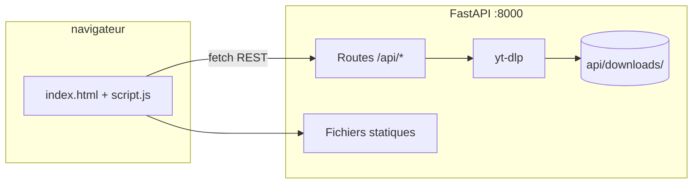

# YouTube Downloader

Application web locale pour prévisualiser et télécharger des vidéos YouTube. Interface HTML/CSS/JS servie par une API **FastAPI** qui s’appuie sur **yt-dlp**.

---

## Sommaire

- [Fonctionnalités](#fonctionnalités)
- [Architecture](#architecture)
- [Prérequis](#prérequis)
- [Installation rapide (Windows)](#installation-rapide-windows)
- [Installation manuelle](#installation-manuelle)
- [Utilisation](#utilisation)
- [Structure du projet](#structure-du-projet)
- [API REST](#api-rest)
- [Configuration](#configuration)
- [Dépannage](#dépannage)
- [Avertissement légal](#avertissement-légal)

---

## Fonctionnalités

- Coller un lien YouTube et afficher automatiquement l’aperçu (titre, chaîne, durée, miniature)
- Lecteur intégré style YouTube : miniature → rectangle 16:9 avec boutons lecture / pause
- Téléchargement asynchrone avec barre de progression en temps réel
- Choix de la qualité : 1080p, 720p, 480p, 360p ou audio MP3
- Formats de sortie : MP4, MP3, WebM
- Annulation d’un téléchargement en cours
- Accès au dernier fichier téléchargé
- Documentation API interactive (Swagger) sur `/docs`

---

## Architecture



| Composant | Rôle |
|-----------|------|
| `index.html`, `style.css`, `script.js` | Interface utilisateur |
| `api/main.py` | API REST + serveur de fichiers statiques |
| `yt-dlp` | Extraction des métadonnées et téléchargement |
| `api/downloads/` | Dossier de stockage des fichiers téléchargés |
| `demarrer.bat` | Lanceur Windows (venv, dépendances, serveur) |

Tout est servi sur **un seul port** : `http://localhost:8000`.

---

## Prérequis

| Outil | Obligatoire | Notes |
|-------|-------------|-------|
| **Python 3.10+** | Oui | Doit être dans le `PATH` |
| **FFmpeg** | Recommandé | Requis pour fusionner vidéo+audio et convertir en MP3. [Télécharger FFmpeg](https://ffmpeg.org/download.html) |
| **Connexion Internet** | Oui | Pour YouTube et l’aperçu embarqué |

Sans FFmpeg, certains formats (MP3, haute qualité avec pistes séparées) peuvent échouer.

---

## Installation rapide (Windows)

1. Cloner ou extraire le projet dans un dossier local.
2. Double-cliquer sur **`demarrer.bat`**.
3. Le script :
   - vérifie que Python est installé ;
   - crée l’environnement virtuel `api/.venv` si nécessaire ;
   - installe les dépendances (`api/requirements.txt`) ;
   - lance l’API sur le port **8000** ;
   - ouvre le navigateur sur `http://localhost:8000`.

Pour arrêter l’application, fermer la fenêtre de terminal « YT API :8000 ».

---

## Installation manuelle

```bash
cd api
python -m venv .venv

# Windows
.venv\Scripts\activate

# Linux / macOS
source .venv/bin/activate

pip install -r requirements.txt
python main.py
```

Ouvrir ensuite : **http://localhost:8000**

Documentation API : **http://localhost:8000/docs**

---

## Utilisation

### Télécharger une vidéo

1. Coller une URL YouTube (`youtube.com` ou `youtu.be`) dans le champ de saisie.
2. Choisir la **qualité** et le **format**.
3. Cliquer sur le bouton de téléchargement (flèche vers le bas) ou appuyer sur **Entrée**.
4. Suivre la progression dans la barre. Le message de statut indique le nom du fichier une fois terminé.

### Aperçu vidéo

- Dès qu’un lien valide est détecté, la carte d’aperçu se remplit automatiquement.
- Utiliser **▶ Lecture** ou cliquer sur la miniature pour lancer l’aperçu YouTube intégré.
- Utiliser **⏸ Pause** pour revenir à la miniature.

### Récupérer un fichier

- Bouton **dossier** : ouvre le dernier fichier téléchargé dans le navigateur.
- Les fichiers sont aussi disponibles dans `api/downloads/` sur le disque.

### Annuler

- Bouton **✕** pendant un téléchargement actif.

---

## Structure du projet

```
yt_web/
├── demarrer.bat          # Lanceur Windows
├── index.html            # Page principale
├── style.css             # Styles (thème YouTube)
├── script.js             # Logique frontend + appels API
├── README.md             # Cette documentation
└── api/
    ├── main.py           # Application FastAPI
    ├── requirements.txt  # Dépendances Python
    ├── cookies.txt       # Cookies YouTube (optionnel)
    ├── downloads/        # Fichiers téléchargés (créé automatiquement)
    └── .venv/            # Environnement virtuel (créé au premier lancement)
```

---

## API REST

Base URL : `http://localhost:8000`

### Santé

| Méthode | Route | Description |
|---------|-------|-------------|
| `GET` | `/health` | Vérifier que l’API répond |

**Réponse :** `{ "status": "ok" }`

---

### Informations vidéo

| Méthode | Route | Description |
|---------|-------|-------------|
| `POST` | `/api/info` | Métadonnées d’une vidéo YouTube |

**Corps :**
```json
{ "url": "https://www.youtube.com/watch?v=XXXXXXXX" }
```

**Réponse :**
```json
{
  "id": "XXXXXXXX",
  "title": "Titre de la vidéo",
  "channel": "Nom de la chaîne",
  "duration": 312,
  "thumbnail": "https://...",
  "webpage_url": "https://..."
}
```

---

### Téléchargement

| Méthode | Route | Description |
|---------|-------|-------------|
| `POST` | `/api/download` | Démarrer un téléchargement (asynchrone) |
| `GET` | `/api/download/{job_id}` | Statut et progression d’un job |
| `POST` | `/api/download/{job_id}/cancel` | Annuler un job en cours |

**Corps de `/api/download` :**
```json
{
  "url": "https://www.youtube.com/watch?v=XXXXXXXX",
  "quality": "1080p",
  "format": "mp4"
}
```

Valeurs `quality` : `1080p`, `720p`, `480p`, `360p`, `audio`  
Valeurs `format` : `mp4`, `mp3`, `webm`

**Réponse job :**
```json
{
  "job_id": "uuid",
  "status": "downloading",
  "progress": 42.5,
  "message": "Démarrage…",
  "filename": null,
  "created_at": "2026-05-29T12:00:00+00:00",
  "updated_at": "2026-05-29T12:00:05+00:00"
}
```

Statuts possibles : `pending`, `downloading`, `completed`, `error`, `cancelled`

Limite : **3 téléchargements simultanés** maximum (erreur `429` au-delà).

---

### Fichiers téléchargés

| Méthode | Route | Description |
|---------|-------|-------------|
| `GET` | `/api/downloads` | Liste des fichiers (du plus récent au plus ancien) |
| `GET` | `/api/downloads/{filename}` | Télécharger un fichier par son nom |

---

## Configuration

### Cookies YouTube (`api/cookies.txt`)

Pour les vidéos restreintes (âge, région, abonnement), exporter les cookies du navigateur au format Netscape et les placer dans `api/cookies.txt`.

Le fichier est lu automatiquement s’il contient des lignes de cookies valides (lignes vides et commentaires `#` ignorés).

### Port et hôte

Par défaut : `127.0.0.1:8000`. Modifiable dans `api/main.py` :

```python
uvicorn.run("main:app", host="127.0.0.1", port=8000, reload=True)
```

### Dossier de téléchargement

Les fichiers sont enregistrés dans `api/downloads/` avec le modèle :

```
{Titre} [{id}].{ext}
```

---

## Dépannage

| Problème | Solution |
|----------|----------|
| `404` sur `/` | Redémarrer l’API. Vérifier que `index.html` est à la racine du projet. |
| `Python n'est pas installé` | Installer Python depuis [python.org](https://www.python.org/) et cocher « Add to PATH ». |
| Erreur FFmpeg / fusion audio-vidéo | Installer FFmpeg et l’ajouter au `PATH`. |
| Vidéo indisponible ou bloquée | Mettre à jour yt-dlp : `pip install -U yt-dlp`. Ajouter `cookies.txt` si nécessaire. |
| `Trop de téléchargements simultanés` | Attendre la fin des jobs en cours ou les annuler. |
| L’aperçu ne se lance pas | Vérifier la connexion Internet (iframe YouTube). |
| CORS / API inaccessible | Utiliser `http://localhost:8000`, pas `file://`. |

### Mettre à jour les dépendances

```bash
cd api
.venv\Scripts\activate
pip install -U -r requirements.txt
```

---

## Avertissement légal

Cet outil est destiné à un **usage personnel et local**. Le téléchargement de contenu YouTube peut être soumis aux [Conditions d'utilisation de YouTube](https://www.youtube.com/t/terms). Respectez les droits d'auteur et n'utilisez cette application que pour du contenu que vous êtes autorisé à télécharger.

---

## Dépendances principales

| Package | Usage |
|---------|-------|
| [FastAPI](https://fastapi.tiangolo.com/) | Framework web |
| [Uvicorn](https://www.uvicorn.org/) | Serveur ASGI |
| [yt-dlp](https://github.com/yt-dlp/yt-dlp) | Téléchargement YouTube |
| [Pydantic](https://docs.pydantic.dev/) | Validation des données |
